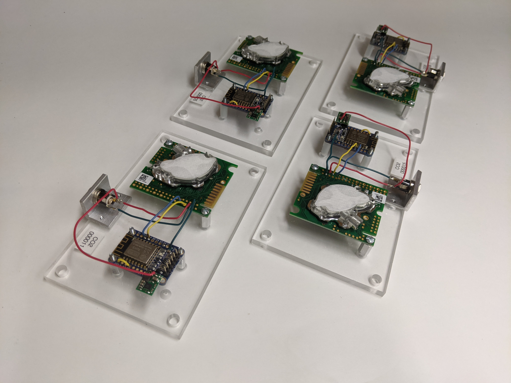

# MQTT CO2 K30

Simple project to get [K30 CO2 sensors](https://www.co2meter.com/products/k-30-co2-sensor-module) online using MQTT.

Designed to work with [mqtt.chem.wisc.edu](https://mqtt.chem.wisc.edu/).

## Repository

This is an open source hardware project licensed under the CERN Open Hardware Licence Version 2 - Permissive.
Please see the LICENSE file for the complete license.

This repository is being mirrored to several version control systems in an attempt to ensure maximum avaliability.

| name             | url                                                   |
| ---------------- | ----------------------------------------------------- |
| GitHub (primary) | https://github.com/uw-madison-chem-shops/mqtt-co2-k30 |
| GitLab           | https://gitlab.com/uw-madison-chem-shops/mqtt-co2-k30 |

